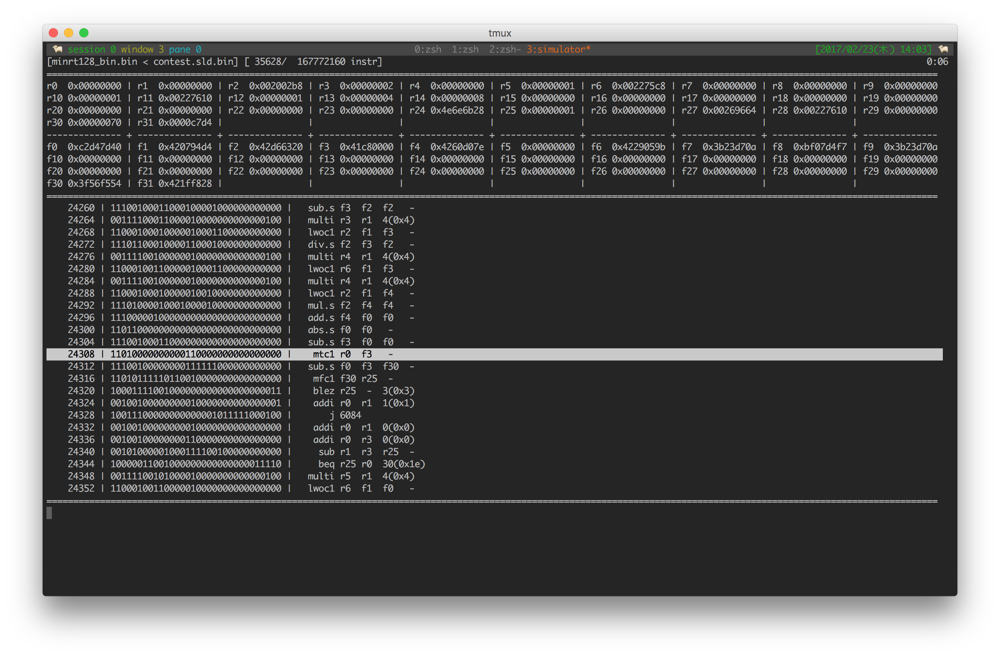

FELIS Simulator
===============

2016年度CPU実験B班の1stアーキテクチャ[FELIS](https://github.com/wafrelka/felis)用シミュレータ。



## ビルド方法
```shell
$ mkdir build; cd $_
$ cmake ..
$ make
```

リンカエラーを起したときは、もう一回`cmake ..`からやり直せば通ります
（`make`時にコード生成しているため）。

`cmake` 時に `NO_ASSERT`オプションをつけると、プログラムカウンタやメモリの範囲チェックを省略し、若干高速化します。

```shell
$ cmake -DNO_ASSERT=On ..
```

## 使いかた
`simulator`は次のように、`-f`オプションに機械語ファイルを渡して実行します。

```shell
$ ./simulator -f test.bin
```

他にもいくつかオプションがあります。

* `-d` -- 逆アセンブル結果を標準出力に吐いて終了します。
* `-i [file]` -- `IN`命令で読むファイルを指定します。
* `-s [int]` -- メモリ量を指定します。`int32_t`の配列をこの要素数だけ確保します。デフォルト値は1,000,000です。
* `-r` -- `HALT`命令まで自動ですすめます。到達後、`q`で終了します。
* `-q` -- `-r`が指定されているとき、`q`の入力を待たずに自動で終了します。
* `-m` -- [出力する統計情報](https://github.com/ordovicia/felis-simulator#%E7%B5%B1%E8%A8%88%E6%83%85%E5%A0%B1)に、メモリの情報を含めます。
* `-n` -- 巻き戻し機能を無効にします。`-r`のときは自動でこの設定が適用されます。
* `-o [file]` -- `OUT`命令の出力先ファイル名を指定します。デフォルト値は`out.log`です。

`-r`オプションを指定しない場合、インタラクティブに実行できます。
画面は水平に四分割され、

* 命令数や実行時間
* レジスタの値
* プログラムカウンタ付近の命令列と逆アセンブル結果
  - 反転しているのが、次に実行する命令
* コマンドライン

を表示しています。

逆アセンブル結果の形式は、

* Type R -- mnemonic, rs, rt, rd, shamt
* Type I -- mnemonic, rs, rt, immediate（負なら符号拡張したものを符号付き、正なら符号なし）
* Type J -- mnemonic, addr

となっています。

コマンドラインは、以下の入力を受け付けます。

* `run|r` -- HALT命令またはbreakpointまで進めます。
* `reset` -- 初期状態にリセットします。
* `(break|b) [int] <int>` -- 指定したプログラムカウンタにbreakpointをはります。自然数を指定すると、その回数だけ命令を実行した後breakします。
* `pb` -- breakpointを表示します。
* `db [int]` -- 指定したbreakpointを削除します。
* `pm [int]` -- 指定したインデックスのメモリの状態を表示します。
* `(step|s) <int>` -- 命令をひとつ実行します。自然数を指定すると、その命令数だけ実行します。
* `prev|p` -- 命令の実行をひとつ巻き戻します。
* `log|l` -- その時点での統計情報を出力します。
* `quit|q` -- 終了します。
* `help|h` -- ヘルプを表示します。

## 統計情報
`HALT`命令が実行されると、以下の統計情報が出力されます。

* `call_cnt.log`に、動的命令数と、プログラムカウンタごとの呼ばれた回数。
* `instruction.log`に、命令ごとの呼ばれた回数。
* `register.log`に、最終的なレジスタの状態。
* `memory.log`に、最終的なメモリの状態。`-m`オプションが指定されているときのみ。
* `memory_access_cnt.log`に、メモリのワードごとのアクセス回数。`-m`オプションが指定されているときのみ。
